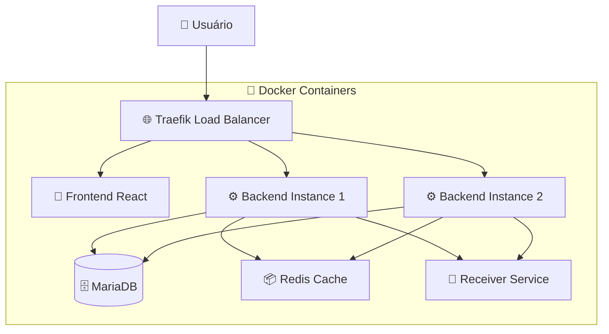

# 🚀 Desafio CRON GLARTEK - Sistema de Gestão de Agendamentos

[](https://opensource.org/licenses/MIT)
[](https://nodejs.org/)
[](https://docs.docker.com/compose/)

Sistema completo de gestão de CRON jobs com arquitetura distribuída, suporte a cluster e interface web moderna.

## 📋 Índice

- [Sobre o Projeto](#-sobre-o-projeto)
- [Características](#-características)
- [Arquitetura](#-arquitetura)
- [Tecnologias](#-tecnologias)
- [Pré-requisitos](#-pré-requisitos)
- [Instalação](#-instalação)
- [Uso](#-uso)
- [API Endpoints](#-api-endpoints)
- [Estrutura do Projeto](#-estrutura-do-projeto)
- [Configuração](#-configuração)
- [Monitoramento](#-monitoramento)
- [Contribuição](#-contribuição)

## 🎯 Sobre o Projeto

Este projeto implementa um serviço robusto de gestão de CRON jobs que permite:

- **Agendar tarefas** com expressões CRON personalizadas
- **Notificar serviços externos** via HTTP quando os jobs executam
- **Gerenciar múltiplas instâncias** em cluster para alta disponibilidade
- **Interface web intuitiva** para configuração e monitoramento
- **Logs centralizados** de todas as execuções

### 💡 Problema Resolvido

Muitas aplicações precisam executar tarefas agendadas de forma confiável. Este sistema oferece:
- Execução distribuída sem duplicação
- Interface amigável para não-técnicos
- Monitoramento em tempo real
- Alta disponibilidade com failover automático

## ⭐ Características

### 🔧 Funcionalidades Core
- ✅ **CRUD completo** de CRON jobs
- ✅ **Suporte a timezones** customizados
- ✅ **HTTP methods variados** (GET, POST, PUT, DELETE)
- ✅ **Body customizável** para requisições
- ✅ **Validação de expressões CRON**

### 🏗️ Arquitetura Avançada
- ✅ **Cluster distribuído** com múltiplas instâncias
- ✅ **Load balancer** com Traefik
- ✅ **Cache Redis** para sincronização
- ✅ **Banco MariaDB** para persistência
- ✅ **Health checks** automáticos

### 🖥️ Interface & Monitoramento  
- ✅ **Frontend React** moderno e responsivo
- ✅ **Logs estruturados** em arquivos
- ✅ **Dashboard Traefik** para monitoramento
- ✅ **Status em tempo real** dos jobs

## 🏛️ Arquitetura



### Fluxo de Execução

1. **Usuário** cria um CRON job via interface web
2. **Load Balancer** distribui requisições entre instâncias
3. **Backend** valida e armazena o job no banco
4. **Redis** sincroniza estado entre instâncias
5. **Scheduler** executa jobs no horário programado
6. **Receiver** registra notificações recebidas

## 🛠️ Tecnologias

### Backend
- **Node.js 18+** - Runtime JavaScript
- **Express** - Framework web
- **node-cron** - Agendamento de tarefas
- **Sequelize** - ORM para banco de dados
- **Redis** - Cache distribuído

### Frontend
- **React** - Biblioteca UI
- **Vite** - Build tool moderna
- **Axios** - Cliente HTTP

### Infraestrutura
- **Docker Compose** - Orquestração de containers
- **Traefik** - Load balancer e proxy reverso
- **MariaDB** - Banco de dados relacional
- **Redis** - Cache em memória

## 📋 Pré-requisitos

- **Docker** 20.10+
- **Docker Compose** 2.0+
- **Git**

## 🚀 Instalação

### 1. Clone o repositório
```bash
git clone https://github.com/jocsas/desafio-cron.git
cd desafio-cron
```

### 2. Inicie os serviços
```bash
# Suba toda a infraestrutura
docker-compose up -d

# Verifique se todos os containers estão rodando
docker-compose ps
```

### 3. Aguarde a inicialização
```bash
# Monitore os logs de inicialização
docker-compose logs -f

# Aguarde até ver "Servidor rodando na porta 3001"
```

### 4. Acesse as interfaces

| Serviço | URL | Descrição |
|---------|-----|-----------|
| 🎨 **Frontend** | http://frontend.localhost | Interface principal |
| ⚙️ **Backend API** | http://backend.localhost/api | API REST |
| 📊 **Traefik Dashboard** | http://localhost:8080 | Monitoramento do cluster |

## 💻 Uso

### Criar um CRON Job

1. Acesse http://frontend.localhost
2. Preencha o formulário:
   - **URI**: `http://localhost:3002/webhook`
   - **Método**: `POST`
   - **Body**: `{"message": "Hello World!"}`
   - **Schedule**: `*/5 * * * *` (a cada 5 minutos)
   - **Timezone**: `America/Sao_Paulo`

3. Clique em "Criar CRON"

### Monitorar Execuções

```bash
# Ver logs do receiver (onde chegam as notificações)
docker logs -f cron-receiver

# Ver logs do backend
docker-compose logs -f cron-backend

# Ver arquivo de log das notificações
docker exec cron-receiver cat /app/logs/cron-notifications.log
```

## 📡 API Endpoints

### CRON Jobs

| Método | Endpoint | Descrição |
|--------|----------|-----------|
| `GET` | `/api/crons` | Listar todos os CRON jobs |
| `POST` | `/api/crons` | Criar novo CRON job |
| `GET` | `/api/crons/:id` | Buscar CRON específico |
| `PUT` | `/api/crons/:id` | Atualizar CRON job |
| `DELETE` | `/api/crons/:id` | Deletar CRON job |

### Exemplo de Payload

```json
{
  "uri": "http://localhost:3002/webhook",
  "httpMethod": "POST",
  "body": "{\"message\": \"Executado às $(date)\"}",
  "schedule": "0 9 * * *",
  "timeZone": "America/Sao_Paulo"
}
```

### Health Check
```bash
curl http://backend.localhost/api/health
```

## 📁 Estrutura do Projeto

```
desafio-cron/
├── 🗂️ backend/                    # API REST e CRON engine
│   ├── 📄 Dockerfile
│   ├── 📦 package.json
│   └── 📂 src/
│       ├── 🗃️ models/            # Modelos de dados
│       ├── 🛣️ routes/            # Rotas da API
│       ├── 🚀 server.js          # Servidor principal
│       └── ⚙️ services/          # Lógica de negócio
├── 🎨 cron-frontend/              # Interface web React
│   ├── 📄 Dockerfile
│   ├── 📦 package.json
│   └── 📂 src/
│       ├── 📱 App.jsx
│       ├── 🧩 components/        # Componentes React
│       └── 🔌 services/          # Integração com API
├── 📡 receiver/                   # Serviço de notificações
│   ├── 📄 Dockerfile
│   ├── 📦 package.json
│   ├── 📂 logs/                  # Logs das notificações
│   └── 📂 src/
├── 🐳 docker-compose.yml         # Orquestração dos serviços
└── 📋 init-permissions.sql       # Setup inicial do banco
```

## ⚙️ Configuração

### Variáveis de Ambiente

#### Backend
```env
SERVER_API_PORT=3001          # Porta da API
DB_HOST=db                    # Host do banco
DB_USER=cron_user            # Usuário do banco
DB_PASS=cron_pass            # Senha do banco
DB_NAME=cron_db              # Nome do banco
REDIS_HOST=redis             # Host do Redis
REDIS_PORT=6379              # Porta do Redis
```

#### Frontend
```env
VITE_BACKEND_URL=http://backend.localhost/api
```

### Escalabilidade

Para aumentar o número de instâncias do backend:

```bash
# Escalar para 3 instâncias
docker-compose up -d --scale cron-backend=3

# Verificar distribuição de carga
curl -v http://backend.localhost/api/health
```

## 📊 Monitoramento

### Métricas Disponíveis

1. **Traefik Dashboard**: http://localhost:8080
   - Status dos backends
   - Distribuição de requisições
   - Health checks

2. **Logs de Aplicação**:
   ```bash
   # Backend logs
   docker-compose logs cron-backend
   
   # Receiver logs
   docker logs cron-receiver
   
   # Arquivo de notificações
   tail -f receiver/logs/cron-notifications.log
   ```

3. **Status do Banco**:
   ```bash
   docker exec cron-db mariadb -u cron_user -pcron_pass cron_db -e "SELECT COUNT(*) as total_jobs FROM CronJobs;"
   ```

### Troubleshooting

| Problema | Solução |
|----------|---------|
| 🔴 Container não sobe | Verifique logs com `docker-compose logs [serviço]` |
| 🔴 Banco não conecta | Aguarde health check com `docker-compose ps` |
| 🔴 Frontend não carrega | Verifique se backend está acessível |
| 🔴 CRON não executa | Verifique logs do backend e valide expressão CRON |

## 🧪 Exemplos de Uso

### CRON para Backup Diário
```json
{
  "uri": "http://backup-service:8080/daily-backup",
  "httpMethod": "POST",
  "body": "{\"type\": \"full\", \"retention\": 30}",
  "schedule": "0 2 * * *",
  "timeZone": "UTC"
}
```

### Notificação de Monitoramento
```json
{
  "uri": "http://monitoring:9090/health-check",
  "httpMethod": "GET",
  "body": "",
  "schedule": "*/10 * * * *",
  "timeZone": "America/Sao_Paulo"
}
```

### Limpeza de Logs Semanal
```json
{
  "uri": "http://log-cleaner:3000/cleanup",
  "httpMethod": "DELETE",
  "body": "{\"older_than\": \"7d\"}",
  "schedule": "0 0 * * 0",
  "timeZone": "Europe/London"
}
```

## 📄 Licença

Este projeto está sob a licença MIT. Veja o arquivo [LICENSE](LICENSE) para detalhes.

## 👤 Autor

**Sua Nome**
- GitHub: [@jocsas](https://github.com/jocsas)
- LinkedIn: [Jocsã Santos](https://linkedin.com/in/jocsa)

---
