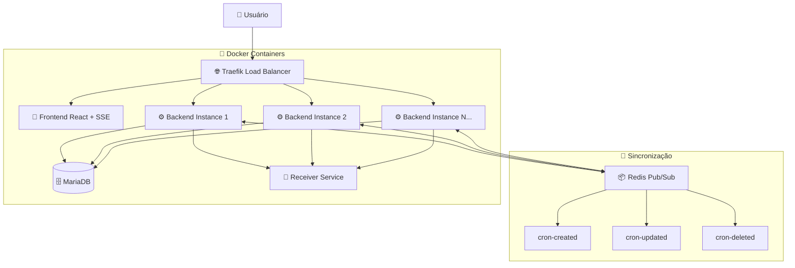

# 🚀 Sistema CRON Distribuído - Gestão de Agendamentos em Cluster

[](https://opensource.org/licenses/MIT)
[](https://nodejs.org/)
[](https://docs.docker.com/compose/)
[](https://reactjs.org/)

Sistema completo de gestão de CRON jobs com arquitetura distribuída, sincronização em tempo real via SSE e interface web moderna.

## 📋 Índice

- [Sobre o Projeto](#-sobre-o-projeto)
- [Características](#-características)
- [Arquitetura](#-arquitetura)
- [Tecnologias](#-tecnologias)
- [Pré-requisitos](#-pré-requisitos)
- [Instalação](#-instalação)
- [Configuração de Desenvolvimento](#-configuração-de-desenvolvimento)
- [Uso](#-uso)
- [API Endpoints](#-api-endpoints)
- [Monitoramento em Tempo Real](#-monitoramento-em-tempo-real)
- [Estrutura do Projeto](#-estrutura-do-projeto)
- [Escalabilidade](#-escalabilidade)

## 🎯 Sobre o Projeto

Sistema robusto de gestão de CRON jobs distribuído que resolve problemas reais de agendamento em ambientes de produção:

- **Execução distribuída** sem duplicação entre instâncias
- **Sincronização em tempo real** via Server-Sent Events (SSE)
- **Interface web intuitiva** com status dinâmico dos jobs
- **Alta disponibilidade** com load balancer e failover automático
- **Monitoramento completo** com logs centralizados e métricas

### 💡 Problema Resolvido

Aplicações modernas precisam de sistemas de agendamento confiáveis que funcionem em clusters. Este projeto oferece:
- Coordenação automática entre múltiplas instâncias
- Prevenção de execuções duplicadas via Redis locks
- Interface visual para gerenciamento não-técnico
- Observabilidade completa do sistema

## ⭐ Características

### 🔧 Funcionalidades Avançadas
- ✅ **CRUD completo** com sincronização Pub/Sub entre instâncias
- ✅ **Status em tempo real** via Server-Sent Events (SSE)
- ✅ **Coordenação distribuída** com Redis locks
- ✅ **Health checks** automáticos e diagnóstico
- ✅ **Graceful shutdown** para finalização limpa
- ✅ **Timezones customizados** com suporte internacional
- ✅ **Validação robusta** de expressões CRON

### 🏗️ Arquitetura Empresarial
- ✅ **Cluster distribuído** com balanceamento automático
- ✅ **Pub/Sub Redis** para sincronização de estado
- ✅ **Load balancer Traefik** com service discovery
- ✅ **Persistência MariaDB** com transações ACID
- ✅ **Logs estruturados** para auditoria e debug

### 🖥️ Interface Moderna  
- ✅ **React + Material-UI** responsivo e acessível
- ✅ **Updates em tempo real** sem refresh da página
- ✅ **Status indicators** visuais (Aguardando/Executando/Parado)
- ✅ **Logs centralizados** com timestamps precisos

## 🏛️ Arquitetura



### Fluxo de Sincronização

1. **Operação CRUD** → Backend atualiza banco de dados
2. **Pub/Sub Redis** → Notifica todas as instâncias da mudança
3. **Sincronização automática** → Instâncias param/iniciam/atualizam crons
4. **SSE Stream** → Frontend recebe status em tempo real
5. **UI atualizada** → Usuário vê mudanças instantaneamente

## 🛠️ Tecnologias

### Backend Avançado
- **Node.js 18+** - Runtime com ES modules
- **Express** - API REST com middleware customizado
- **node-cron** - Scheduler robusto com timezone support
- **Sequelize ORM** - Migrations e relacionamentos
- **ioredis** - Cliente Redis com Pub/Sub e clustering
- **Server-Sent Events** - Streaming de status em tempo real

### Frontend Moderno
- **React 18** - Hooks, Suspense e Error Boundaries  
- **Material-UI v5** - Componentes acessíveis e responsivos
- **Axios** - Cliente HTTP com interceptors
- **EventSource** - SSE client com reconexão automática

### Infraestrutura Cloud-Ready
- **Docker Compose** - Orquestração multi-container
- **Traefik v3** - Load balancer com SSL automático
- **MariaDB 11** - RDBMS com replicação
- **Redis 7** - Cache, Pub/Sub e distributed locks

## 📋 Pré-requisitos

- **Docker Engine** 24.0+
- **Docker Compose** 2.21+
- **Git** 2.30+
- **4GB RAM** disponível
- **Portas livres**: 80, 443, 8080

## 🚀 Instalação

### 1. Clone o repositório
```bash
git clone https://github.com/jocsas/desafio-cron.git
cd desafio-cron
```

### 2. Ambiente de Produção
```bash
# Build e inicia todos os serviços
docker compose up --build -d

# Verifica status dos containers
docker compose ps
```

### 3. Monitore a inicialização
```bash
# Acompanha logs de inicialização
docker compose logs -f

# Aguarde mensagens:
# ✅ "Servidor rodando na porta 3001"
# ✅ "X CRONs carregados do DB e iniciados"
# ✅ "SSE conectado"
```

### 4. Acesse o sistema

| Serviço | URL Local | Descrição |
|---------|-----------|-----------|
| 🎨 **Frontend** | http://frontend.localhost | Interface principal |
| ⚙️ **Backend API** | http://backend.localhost/api | API REST + SSE |
| 📊 **Traefik Dashboard** | http://localhost:8080 | Load balancer status |
| 📡 **Receiver Logs** | `docker logs cron-receiver` | Webhook receiver |

## 🛠️ Configuração de Desenvolvimento

Para desenvolvimento local com hot-reload e debug:

### 1. Use o override de desenvolvimento
```bash
# O arquivo docker-compose.override.yml é automaticamente usado
docker compose up --build -d

# Ou especificamente:
docker compose -f docker-compose.yml -f docker-compose.override.yml up --build -d
```

### 2. Recursos de desenvolvimento disponíveis
- **Hot reload** no frontend (Vite dev server)
- **Nodemon** no backend para restart automático
- **Volume mounts** para código local
- **Debug ports** expostos
- **Logs detalhados** habilitados

### 3. Estrutura dos arquivos compose
```
docker-compose.yml          # Configuração base (produção)
docker-compose.override.yml # Sobrescreve para desenvolvimento
```

### 4. Debug e logs
```bash
# Logs específicos por serviço
docker compose logs -f cron-backend
docker compose logs -f cron-frontend
docker compose logs -f redis

# Debug do Redis Pub/Sub
docker compose exec redis redis-cli monitor
```

## 💻 Uso

### Criar um CRON Job

1. **Acesse** http://frontend.localhost
2. **Preencha o formulário**:
   ```json
   URI: http://localhost:3002/webhook
   Método: POST
   Body: {"message": "Hello World!", "timestamp": "$(date)"}
   Schedule: */30 * * * * (a cada 30 segundos)
   Timezone: Europe/Lisbon
   ```
3. **Clique "Criar CRON"**
4. **Observe** status mudando para "Aguardando" em tempo real

### Monitorar em Tempo Real

A interface atualiza automaticamente via SSE mostrando:
- 🟢 **Aguardando** - Cron agendado, esperando próxima execução
- 🟠 **Executando** - Fazendo requisição HTTP neste momento  
- 🔴 **Parado** - Não agendado nesta instância
- 🔘 **Desconhecido** - Sem conexão SSE

### Logs Detalhados
```bash
# Execuções dos crons
docker compose logs -f cron-backend

# Webhooks recebidos
docker logs -f cron-receiver

# Arquivo estruturado de notificações
docker compose exec cron-receiver cat /app/logs/cron-notifications.log
```

## 📡 API Endpoints

### CRON Jobs CRUD
| Método | Endpoint | Descrição | Pub/Sub |
|--------|----------|-----------|---------|
| `GET` | `/api/crons` | Lista todos os CRONs | - |
| `POST` | `/api/crons` | Cria novo CRON | `cron-created` |
| `PUT` | `/api/crons/:id` | Atualiza CRON | `cron-updated` |
| `DELETE` | `/api/crons/:id` | Remove CRON | `cron-deleted` |

### Status e Monitoramento
| Método | Endpoint | Descrição |
|--------|----------|-----------|
| `GET` | `/api/crons/status/stream` | **SSE** - Status em tempo real |
| `GET` | `/api/health` | Health check da instância |

### Exemplo de Payload Completo
```json
{
  "uri": "http://external-service:8080/webhook",
  "httpMethod": "POST", 
  "body": {
    "event": "scheduled_task",
    "timestamp": "{{timestamp}}",
    "data": {
      "type": "backup",
      "database": "production"
    }
  },
  "schedule": "0 2 * * *",
  "timeZone": "UTC"
}
```

## 📊 Monitoramento em Tempo Real

### Server-Sent Events (SSE)
```javascript
// Frontend conecta automaticamente
const eventSource = new EventSource('/api/crons/status/stream');

eventSource.onmessage = (event) => {
  const status = JSON.parse(event.data);
  // Atualiza interface em tempo real
  console.log('Status recebido:', status);
};
```

### Estrutura do Status SSE
```json
{
  "instanceId": "550e8400-e29b-41d4-a716-446655440000",
  "totalCrons": 5,
  "activeCrons": 3,
  "crons": [
    {
      "id": "cron-123",
      "schedule": "*/30 * * * *",
      "uri": "http://localhost:3002/webhook",
      "running": true,
      "lastExecutedAt": "2025-08-17T18:04:16.010Z",
      "isLocked": false
    }
  ]
}
```

### Health Check Avançado
```bash
curl http://backend.localhost/api/health | jq .
```
```json
{
  "status": "healthy",
  "instanceId": "instance-1",
  "redis": "connected", 
  "database": "connected",
  "totalCronsDB": 10,
  "activeCronsInstance": 8
}
```

## 📁 Estrutura do Projeto

```
cron-distribuido/
├── 🗂️ backend/                        # API REST + CRON Engine
│   ├── 📄 Dockerfile
│   ├── 📦 package.json
│   └── 📂 src/
│       ├── 🗃️ models/                # Sequelize models
│       │   └── CronJob.js
│       ├── 🛣️ routes/                # Express routes  
│       │   ├── cronRoutes.js
│       │   └── healthRoutes.js
│       ├── ⚙️ services/              # Business logic
│       │   └── cronService.js        # Core CRON logic
│       ├── 🚀 server.js              # Express server
│       └── 📄 database.js            # DB connection
├── 🎨 cron-frontend/                  # React SPA
│   ├── 📄 Dockerfile
│   ├── 📦 package.json
│   ├── 🔧 vite.config.js
│   └── 📂 src/
│       ├── 📱 App.jsx                # Main component
│       ├── 🧩 components/            # React components
│       │   ├── CronForm.jsx          # Create/Edit form
│       │   └── CronList.jsx          # Real-time list
│       └── 🔌 services/              # API integration
│           └── cronApi.js            # Axios + SSE
├── 📡 receiver/                       # Webhook receiver
│   ├── 📄 Dockerfile
│   ├── 📦 package.json
│   ├── 📂 logs/                      # Structured logs
│   │   └── cron-notifications.log
│   └── 📂 src/
│       └── server.js
├── 🐳 docker-compose.yml             # Production setup
├── 🛠️ docker-compose.override.yml    # Development overrides
└── 📋 init-permissions.sql           # DB initialization
```

## 🚀 Escalabilidade

### Scaling Horizontal
```bash
# Adiciona mais instâncias do backend
docker compose up -d --scale cron-backend=5

# Verifica distribuição no Traefik
curl http://localhost:8080/api/http/services
```

### Configuração de Cluster
```yaml
# Em docker-compose.yml
services:
  cron-backend:
    deploy:
      replicas: 3
      resources:
        limits:
          memory: 512M
        reservations:
          memory: 256M
```

### Métricas de Performance
```bash
# Status de todas as instâncias
for i in {1..3}; do
  curl -s http://backend.localhost/api/health | jq -r '.instanceId + ": " + .status'
done

# Monitoramento Redis
docker compose exec redis redis-cli --latency-history -i 1
```

## 🔧 Configuração Avançada

### Variáveis de Ambiente

#### Backend
```env
# Servidor
SERVER_API_PORT=3001
NODE_ENV=production

# Database
DB_HOST=db
DB_PORT=3306
DB_USER=cron_user
DB_PASS=cron_pass
DB_NAME=cron_db

# Redis
REDIS_HOST=redis
REDIS_PORT=6379
REDIS_PASSWORD=

# Logs
LOG_LEVEL=info
LOG_FILE=./logs/app.log
```

#### Frontend
```env
# API Backend
VITE_BACKEND_URL=http://backend.localhost/api

# Features
VITE_SSE_ENABLED=true
VITE_DEBUG_MODE=false
```

### Segurança
```bash
# Redis com autenticação
echo "requirepass your-redis-password" >> redis.conf

# MariaDB com SSL
# Configurar certificados em ./ssl/
```

## 🐛 Troubleshooting

### Problemas Comuns

| Sintoma | Causa Provável | Solução |
|---------|----------------|---------|
| 🔴 SSE não conecta | Backend não iniciado | `docker compose logs cron-backend` |
| 🔴 Crons não executam | Redis desconectado | `docker compose restart redis` |
| 🔴 Status "Desconhecido" | Pub/Sub falhou | Verificar logs Redis |
| 🔴 Frontend branco | API inacessível | Verificar proxy Traefik |
| 🔴 Execuções duplicadas | Lock Redis falhou | Reiniciar instâncias |

### Debug Avançado
```bash
# Pub/Sub em tempo real
docker compose exec redis redis-cli
> SUBSCRIBE cron-created cron-updated cron-deleted

# Locks ativos
docker compose exec redis redis-cli KEYS "cron-lock:*"

# Logs estruturados
docker compose logs --tail=100 -t cron-backend | grep ERROR
```

### Performance Tuning
```bash
# Monitorar recursos
docker stats

# Otimizar Redis
echo "maxmemory 512mb" | docker compose exec -T redis tee -a /etc/redis/redis.conf
echo "maxmemory-policy allkeys-lru" | docker compose exec -T redis tee -a /etc/redis/redis.conf
```

## 🧪 Exemplos Práticos

### Backup Automatizado
```json
{
  "uri": "http://backup-service:8080/start-backup",
  "httpMethod": "POST",
  "body": {
    "type": "incremental",
    "databases": ["production", "analytics"],
    "compression": true,
    "retention_days": 30
  },
  "schedule": "0 3 * * *",
  "timeZone": "UTC"
}
```

### Monitoramento de Saúde
```json
{
  "uri": "http://monitoring:9090/collect-metrics",
  "httpMethod": "GET",
  "schedule": "*/2 * * * *",
  "timeZone": "America/Sao_Paulo"
}
```

### Processamento de Dados
```json
{
  "uri": "http://data-processor:3000/process-batch",
  "httpMethod": "POST",
  "body": {
    "batch_size": 1000,
    "source": "daily_transactions",
    "target": "data_warehouse"
  },
  "schedule": "0 1 * * *",
  "timeZone": "America/New_York"
}
```

## 📄 Licença

Este projeto está sob a licença MIT. Veja o arquivo [LICENSE](LICENSE) para detalhes.

## 👤 Autor

**Jocsã Santos**
- 🐙 GitHub: [@jocsas](https://github.com/jocsas)
- 💼 LinkedIn: [Jocsã Santos](https://linkedin.com/in/jocsa)
- 📧 Email: jocsa.dev@gmail.com

---

⭐ **Se este projeto foi útil, considere dar uma estrela!** ⭐